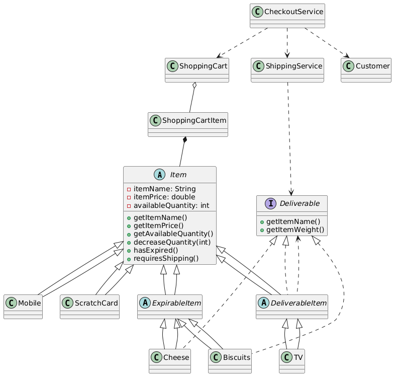

# Fawry E-commerce System

## Overview
Welcome to the Fawry E-commerce System! This Java-based console application is designed to simulate a real-world e-commerce checkout experience. The system models products (with expiry and shipping logic), customers, shopping carts, and a robust checkout process. It is built with extensibility and clarity in mind, following object-oriented best practices.

## Features
- Define products with name, price, and quantity.
- Support for expirable products (e.g., Cheese, Biscuits) and non-expirable products (e.g., TV, Mobile).
- Support for shippable products with weight (e.g., Cheese, TV) and non-shippable products (e.g., Mobile, ScratchCard).
- Customers can add products to a cart, with quantity validation against available stock and expiry.
- Checkout process calculates subtotal, shipping, total, and updates customer balance.
- Clear error handling for empty cart, insufficient balance, out-of-stock, and expired products.
- ShippingService groups and lists shippable items in a clear, user-friendly format.

## Assumptions
- All data is stored in memory (no database or file storage).
- Product expiry is represented as a boolean flag for simplicity.
- Shipping fee is a flat rate per shippable item.
- The system is a console application, designed for demonstration and learning.


## Example Usage
Below is a simple example of how the system works. You can find more scenarios in the `Main.java` file.

```java
public class Main {
    public static void main(String[] args) {
        Cheese cheese = new Cheese("Cheese", 100, 10, false, 400);
        TV tv = new TV("TV", 5000, 3, 8000);
        Customer customer = new Customer("Ali", 1000);
        ShoppingCart cart = new ShoppingCart();
        try {
            cart.add(cheese, 2);
            cart.add(tv, 1);
        } catch (IllegalArgumentException e) {
            System.err.println(e.getMessage());
        }
        CheckoutService.checkout(customer, cart);
    }
}
```

**Expected Output:**
```
** Shipment notice **
2x Cheese       400g
1x TV           8000g
Total package weight 8.8kg
** Checkout receipt **
2x Cheese          200
1x TV              5000
----------------------
Subtotal         5200
Shipping         90
Amount           5290
Customer balance after payment: -4290
```

## Example Scenarios & Screenshots
Below are key scenarios you can run and screenshot for your submission. Add your screenshots below each scenario:

### 1. Normal Checkout (with valid products and enough balance)
> _Screenshot here:_
> 

### 2. Out of Stock
> _Screenshot here:_
> 

### 3. Expired Product
> _Screenshot here:_
> 

### 4. Insufficient Balance
> _Screenshot here:_
> 

### 5. Only Non-Shippable Products
> _Screenshot here:_
> 

### 6. Empty Cart
> _Screenshot here:_
> 

---

## UML/Class Diagram
> _place holder for my class diagram diagram ._
> 

**Diagram Explanation:**
- `Item` is the abstract base for all products.
- `ExpirableItem` and `DeliverableItem` are specializations for expirable and shippable products.
- Concrete products (e.g., Cheese, TV) inherit from these.
- `Deliverable` is an interface for shippable items.
- `ShoppingCart` contains `ShoppingCartItem` objects, each referencing an `Item` and quantity.
- `Customer` holds customer data and balance.
- `ShippingService` and `CheckoutService` handle shipping and checkout logic.

## Design Notes
- The system uses inheritance and interfaces to model product types and behaviors.
- All error messages are clear and user-friendly.
- The code is modular, easy to extend, and thoroughly tested with edge cases.
- Scenarios in `Main.java` cover all requirements and corner cases.


